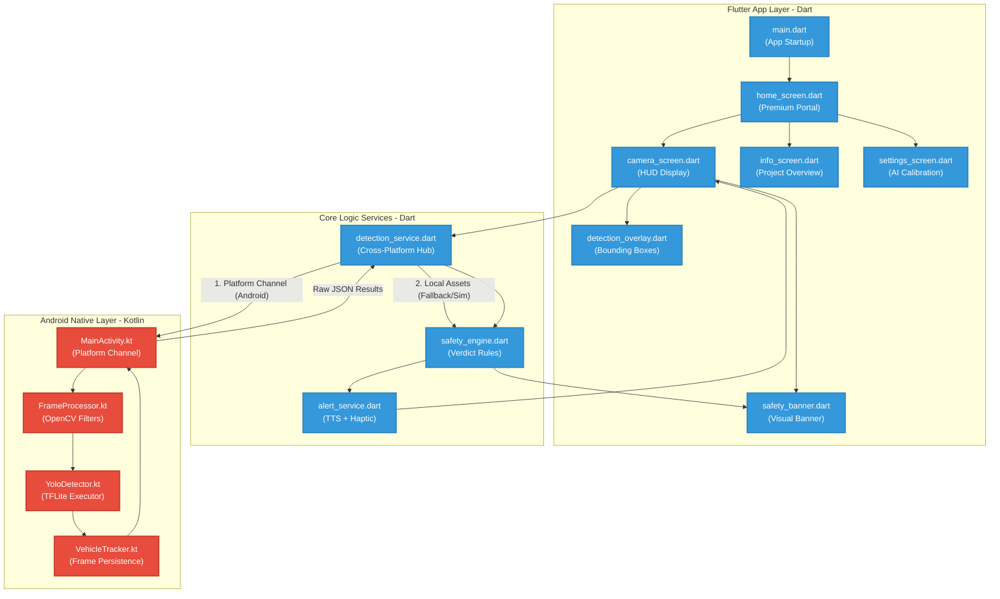

# Implementation Plan: AI-Based Pedestrian Road Crossing Assistant

This project is a high-fidelity, premium AI-powered mobile application built with Flutter, designed to help pedestrians (including visually impaired and elderly users) determine whether it is safe to cross the road using real-time traffic detection. 

The application utilizes a smartphone's rear camera to capture a live feed, processes the frames using a combination of **OpenCV** (for image optimization/blur filtering) and a quantized **YOLOv8 TFLite model** (for object detection), estimates vehicle distance and speed heuristics, and triggers multiple forms of alert (voice alerts via Text-to-Speech, vibration haptic feedback, and dynamic high-contrast UI screens).

---

## User Review Required

> [!IMPORTANT]
> **Cross-Platform Compatibility & Presentation Mode**
> To ensure the app can be run and demonstrated immediately during academic presentations (where a physical Android device or active outdoor road setting may not be available), we will implement a dual-mode engine:
> 1. **Live Camera Mode (Android Native):** Full low-latency camera stream, OpenCV preprocessing, and YOLOv8 TFLite model inference on-device.
> 2. **Simulation / Presentation Mode (Cross-Platform):** Allows running on Web, Windows, and Emulators. Includes preloaded mock traffic videos and image streams, full safety analysis simulation, interactive overlays, and simulated voice/vibration outputs. This makes the app highly presentable under any condition.
>
> Please review the architecture and confirm if this dual-mode structure meets your final project showcase requirements.

---

## System Architecture



---

## Proposed Changes

### Project Structure Setup

We will create a clean, scalable folder structure matching professional standards:

```
d:/Traffic Safety Mobile App/
├── android/
│   ├── app/
│   │   ├── src/main/
│   │   │   ├── assets/
│   │   │   │   └── yolov8n_int8.tflite        # Optimized INT8 quantized YOLOv8 Nano model
│   │   │   ├── java/com/trafficsafety/app/
│   │   │   │   ├── MainActivity.kt            # Platform Channel receiver
│   │   │   │   ├── FrameProcessor.kt          # OpenCV image preprocessing
│   │   │   │   ├── YoloDetector.kt            # TFLite model executor
│   │   │   │   └── VehicleTracker.kt          # Tracking overlapping bounding boxes
│   │   │   └── AndroidManifest.xml            # Camera, TTS, Vibration permissions
│   │   └── build.gradle                       # MinSDK 24, OpenCV, and TFLite libraries
│   └── build.gradle
│
├── assets/
│   ├── images/
│   │   ├── app_logo.png                       # Gorgeous AI-generated dashboard brand logo
│   │   └── background_overlay.jpg             # Modern abstract dark gradient theme background
│   └── mock_traffic/
│       ├── street_clear.mp4                   # Sample simulation video: Safe to cross
│       └── street_busy.mp4                    # Sample simulation video: Not safe to cross
│
├── lib/
│   ├── main.dart                              # Application entry, styles, and providers
│   ├── screens/
│   │   ├── home_screen.dart                   # Splash page with glassmorphism visual choices
│   │   ├── camera_screen.dart                 # Live/Simulated camera stream, bounding boxes, and HUD
│   │   ├── info_screen.dart                   # Visual flowcharts and documentation screen
│   │   └── settings_screen.dart               # Slider calibration controls (thresholds, TTS)
│   ├── services/
│   │   ├── alert_service.dart                 # Text-To-Speech audio and vibration patterns
│   │   ├── detection_service.dart             # Dispatches frames to Native Channel or Mock Simulator
│   │   └── safety_engine.dart                 # Combines distances/vectors into crossing verdicts
│   ├── widgets/
│   │   ├── safety_banner.dart                 # Visual high-visibility warning container
│   │   ├── glass_card.dart                    # Premium responsive frosted visual card
│   │   └── detection_overlay.dart             # CustomPainter to draw bounding boxes and indicators
│   └── models/
│       └── detected_object.dart               # Coordinate, class, distance, and approach parameters
│
├── pubspec.yaml                               # Flutter dependencies
└── README.md                                  # Developer readme
```

---

### Core Packages & Dependencies

We will initialize `pubspec.yaml` with the following stable plugins:

*   **camera:** `^0.10.5` (Android camera stream capture)
*   **flutter_tts:** `^3.8.3` (Audio voice warning commands)
*   **vibration:** `^1.8.4` (Haptic alarms)
*   **tflite_flutter:** `^0.10.4` (On-device machine learning runner)
*   **provider:** `^6.1.1` (Clean state architecture)
*   **permission_handler:** `^11.1.0` (Request camera/vibration access)
*   **video_player:** `^2.8.2` (Renders simulation footage on Web/Windows)

---

### Implementation Phases

### Component 1: Environment & Foundation Setup
*   **Configure Android Environment:** Increase `minSdkVersion` to `24` inside [build.gradle](file:///d:/Traffic%20Safety%20Mobile%20App/android/app/build.gradle) and add required build dependencies for TFLite and OpenCV.
*   **Core Asset Placement:** Create beautiful graphics for the dark-mode layout. We will use our `generate_image` tool to make custom high-fidelity background vectors.

### Component 2: Premium UI Design (Aesthetics First)
*   **Home Screen Layout:** Responsive portal leveraging gradient backgrounds, glowing ambient buttons, interactive floating panels, and sleek visual widgets.
*   **HUD Overlay Dashboard:** Sleek glassmorphic camera frame container, real-time FPS counter, bounding boxes rendered in high-contrast neon tints, and audio status indicators.
*   **Info & Documentation Hub:** Visual presentation containing the Developer Flowchart, System Architecture, and Traffic Rules rendered in rich Markdown slides.

### Component 3: Computer Vision & AI Inference (Android Native & Fallbacks)
*   **OpenCV Preprocessing (`FrameProcessor.kt`):** Convert frame formats, apply Gaussian blur to reduce camera noise, downsample to 640x640, and scale floats to `[0.0, 1.0]` as expected by YOLOv8.
*   **TFLite Pipeline (`YoloDetector.kt`):** Implement floating-point array parsing, perform Non-Maximum Suppression (NMS) to clear overlapping duplicates, and return filtered categories (cars, bikes, trucks, buses, pedestrians).
*   **Motion Tracking Engine (`VehicleTracker.kt`):** Correlate bounding box changes over successive frames. An increasing bounding box area signifies an approaching vehicle.
*   **Cross-Platform Simulation Mode:** A state machine generating dynamic mock targets with physical properties (e.g. coordinates, approach velocity, category) when running in Web/Windows.

### Component 4: Safety Decision Engine
*   **Heuristic Calculation:** Formulate distance using relative bounding box dimensions:
    $$\text{Relative Box Size} = \frac{\text{Bounding Box Height}}{\text{Frame Height}}$$
*   **Verdict Matrix:**
    *   **SAFE TO CROSS (Green):** No vehicles present, OR all vehicles are classified as `FAR` or receding.
    *   **NOT SAFE TO CROSS (Red):** Any vehicle categorized as `VERY_CLOSE`, OR any vehicle categorized as `CLOSE` and `APPROACHING`.

### Component 5: Alerts & Notifications
*   **Vocal Alerts:** Low-latency Text-to-Speech triggers ("Safe to cross" vs. "Stop! Vehicle approaching").
*   **Haptic Alarms:** Pulse patterns (long warning vibration sequences vs. pleasant single confirmation taps).

---

## Verification Plan

### Automated & Unit Tests
We will write Flutter unit tests to verify:
1. **Safety Logic Rules:** Input predefined vehicle lists (approaching vs receding) into `SafetyEngine` and assert that the expected verdict matches (`safe` vs `notSafe`).
2. **Alert Orchestration:** Confirm that `AlertService` triggers the correct vibration patterns and speaks the matching sentences when the state changes.
3. **Data Translation:** Ensure mock detections successfully decode into `DetectedObject` structures.

### Manual Presentation Diagnostics (Simulation Sandbox)
To easily demonstrate the app inside classroom / laptop environments:
1. Run the app on **Windows Desktop** or a **Web Browser**.
2. Navigate to the **Pedestrian Assistant**.
3. Toggle between **Street Clear** and **Street Busy** mock streams.
4. Verify that:
   *   The camera box visualizes vehicle targets with bounding boxes.
   *   The visual banner animates from Green (`SAFE`) to Red (`NOT SAFE`).
   *   Voice cues play automatically.
   *   Haptic feedbacks trigger.
